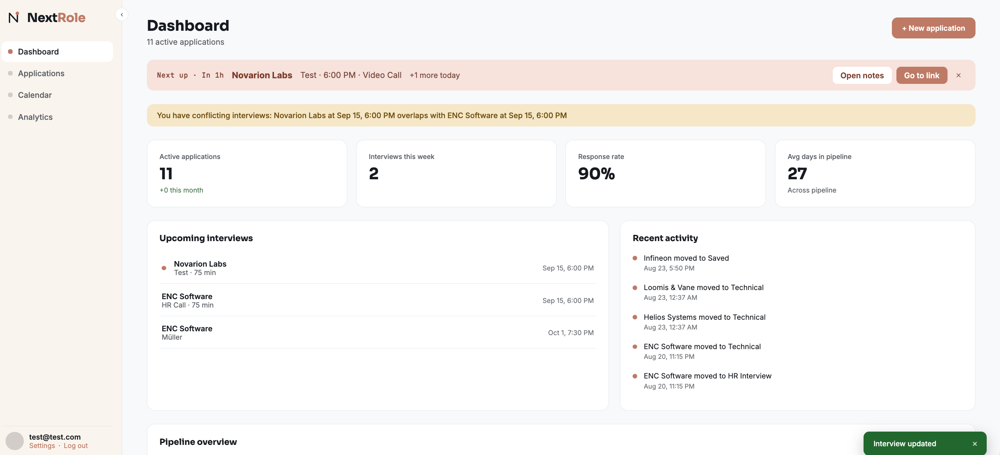
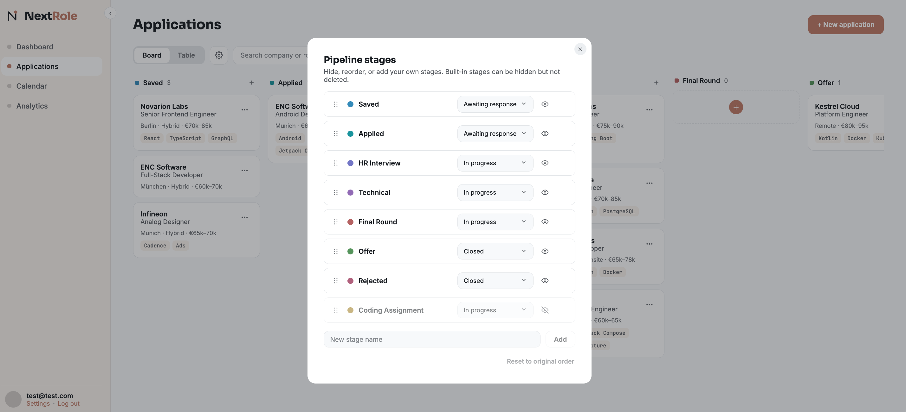
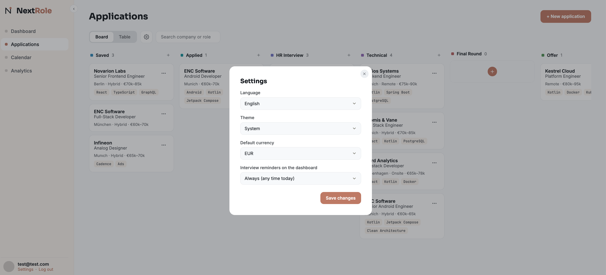

# NextRole

A job application tracker built as a proper full-stack project — not just a CRUD dashboard.
Track applications through a real pipeline (Saved → Applied → HR Interview → Technical →
Final → Offer / Rejected), with status history, interviews, contacts, notes, a dashboard,
a calendar, and analytics.

## Screenshots

| | |
|---|---|
|  |  |
| Login | Dashboard — stat tiles, a reminder banner for the next interview, and a conflict warning when two overlap |
|  |  |
| Application detail — Overview (job description, tech stack, key dates) | Status History |
|  |  |
| Interviews — duration, mode, meeting link and a time-gated "Join meeting" | Contacts |
|  |  |
| Notes (markdown-lite formatting, newest/oldest sort) | Calendar — event banners on day cells, with the selected day's agenda |
|  |  |
| Analytics — funnel, conversion rate, top technologies, applications over time, work mode | Pipeline stages — hide, reorder, recolour, or add your own |
|  | |
| Settings — language, theme, default currency, interview reminders | |

## Stack

| Layer     | Tech |
|-----------|------|
| Frontend  | React + TypeScript (Vite), react-router-dom, react-i18next |
| Backend   | Kotlin + Spring Boot |
| Database  | PostgreSQL (Flyway migrations) |
| Auth      | JWT access tokens + rotating refresh tokens (Spring Security, BCrypt), rate-limited via bucket4j |
| Mobile    | Flutter (separate repo, in progress) |
| Infra     | Docker / Docker Compose |
| Testing   | JUnit + MockK (backend), Vitest + React Testing Library (frontend) |

## Current features

**Applications**
- Full CRUD: company, role, location, work mode, salary range + currency, tech stack, job
  description, application date, status
- Board (kanban) and table views, with search, a filters popover, and column sorting
- Customisable pipeline stages — add, rename, reorder, recolour and hide stages; applications
  are reassigned when a stage is removed

**Application detail**
- Overview with inline-editable job description (lightweight markdown for `**bold**` and lists),
  tech stack, and key dates
- Status History, Interviews, Contacts and Notes — all full CRUD with edit/delete and toast
  feedback

**Interviews**
- Round, interviewer, scheduled time, duration, mode and meeting link
- A single "Join meeting" action that becomes live near the scheduled start
- **Double-booking detection**: overlapping interviews are flagged on the interview form (as you
  pick a time), on interview cards, on the application overview and on the Dashboard. Conflicts
  are resolved server-side across every upcoming interview, so a clash with one too far out to be
  listed is still reported. It is a warning, never a block — "Save anyway" is always available.

**Dashboard**
- Stat tiles, upcoming interviews, recent activity, pipeline overview
- Configurable interview reminder banner (off / always / 3, 12 or 24 hours ahead) with snooze

**Calendar**
- Month grid with per-day event banners, plus the day's detail

**Analytics**
- Pipeline funnel, stage conversion rate, top technologies, applications over time, applications
  by work mode

**Settings and platform**
- Language (English, German, Turkish), default currency, light/dark theme
- Custom confirm dialogs for every destructive action — no native browser popups

Not yet built: the job-description analyzer (paste a posting, extract required
languages / frameworks / experience / skill-match). A Flutter mobile client is in progress in a
separate repository.

## Auth model

Login and registration return a short-lived **access token** (15 minutes) and a longer-lived
**refresh token** (30 days). Refresh tokens **rotate**: every refresh issues a new one and
revokes the one presented, so a stolen token is usable at most once. Replaying an
already-rotated token is treated as a breach and revokes every token for that user. Only a
SHA-256 hash of each token is stored.

Clients should refresh on a 401 and retry once. Because refresh tokens are single-use,
**concurrent 401s must share a single in-flight refresh** — two parallel refreshes would replay a
rotated token and end the session.

Both lifetimes are overridable via `JWT_EXPIRATION_MS` and `JWT_REFRESH_EXPIRATION_MS`; shortening
the first is a convenient way to exercise the refresh path without waiting.

## Getting started

### Prerequisites

- **JDK 21 or 22** for the backend. Gradle 8.10 does not support Java 25 and fails with a bare
  `* What went wrong: 25.0.2`, which gives no hint that the JDK is the problem. Check with
  `java -version`; if you have a newer JDK as your default, point Gradle at a supported one:

  ```bash
  JAVA_HOME=$(/usr/libexec/java_home -v 22) ./gradlew build
  ```

  Or set `org.gradle.java.home` in `backend/gradle.properties` to avoid passing it every time.
- **Node 20+** and npm for the frontend (Vite 8's minimum; developed on Node 24).
- **Docker** if you want the Compose setup below.

### Option A — Docker Compose (backend + database)

```bash
cp .env.example .env   # fill in a real JWT_SECRET
docker compose up
```

This starts PostgreSQL and the Spring Boot API on `http://localhost:8080`, running Flyway
migrations automatically on startup.

### Option B — run the backend natively

```bash
cd backend
./gradlew bootRun
```

Requires JDK 21/22 (see prerequisites above) and a local PostgreSQL instance matching the connection details in
`backend/src/main/resources/application.yml` (or override via `DB_URL`, `DB_USERNAME`,
`DB_PASSWORD` env vars).

### Frontend

```bash
cd frontend
npm install
npm run dev
```

Runs on `http://localhost:5173` and talks to the backend at `http://localhost:8080` by
default (override with `VITE_API_BASE_URL`, see `frontend/.env.example`).

## Testing

```bash
cd backend && ./gradlew test        # JUnit + MockK
cd frontend && npm test             # Vitest + React Testing Library
cd frontend && npx tsc -b --noEmit  # typecheck
```

If `./gradlew test` fails immediately with `* What went wrong: 25.0.2`, your default JDK is too
new — see Prerequisites.

## Project layout

```
NextRole/
  backend/    Kotlin/Spring Boot API
  frontend/   React/TypeScript app (Vite)
  docs/       Screenshots and other documentation assets
  docker-compose.yml
```

The Flutter mobile client lives in its own repository and consumes this same API.
