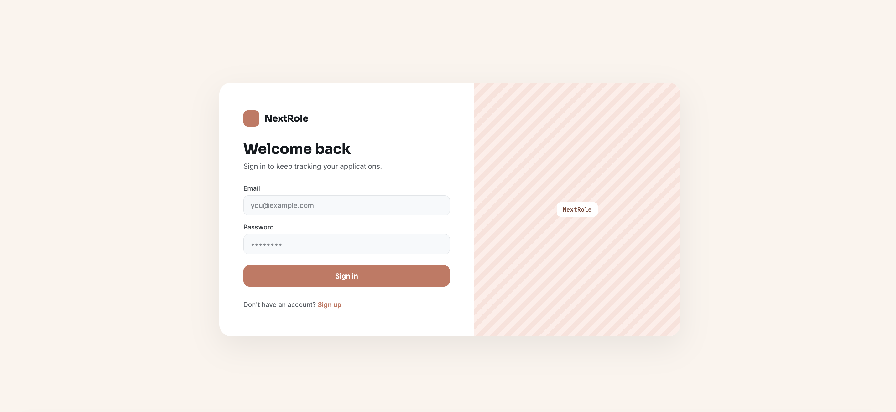
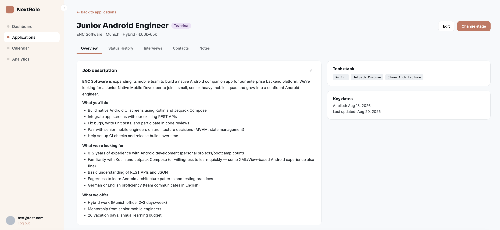
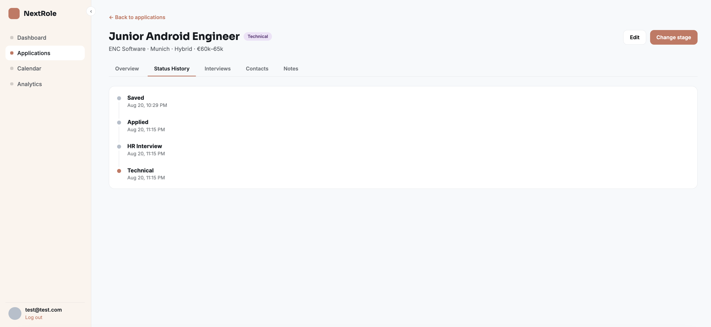
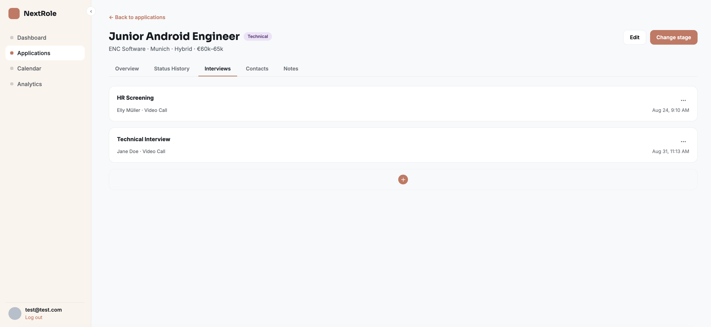
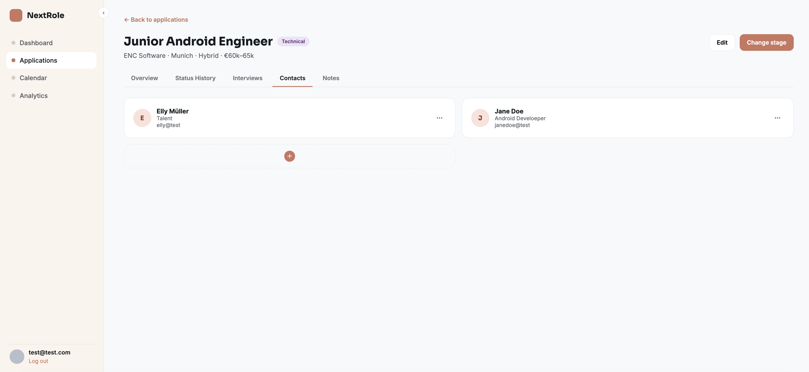
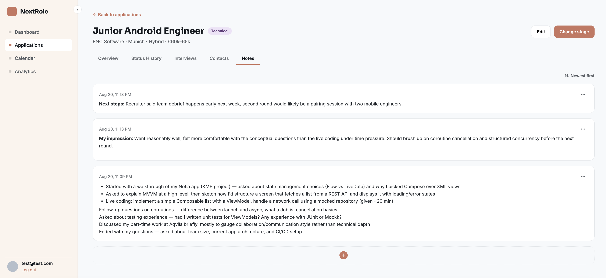
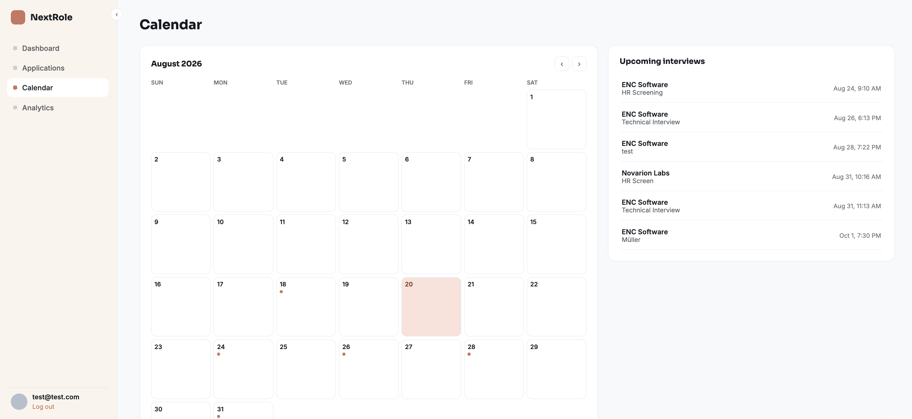
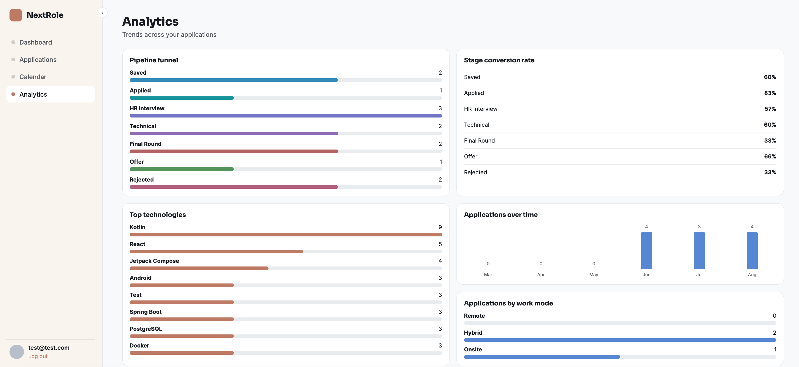

# NextRole

A job application tracker built as a proper full-stack project — not just a CRUD dashboard.
Track applications through a real pipeline (Saved → Applied → HR Interview → Technical →
Final → Offer / Rejected), with status history, interviews, contacts, notes, a dashboard,
a calendar, and analytics.

## Screenshots

| | |
|---|---|
|  |  |
| Login | Application detail — Overview (job description, tech stack, key dates) |
|  |  |
| Status History | Interviews |
|  |  |
| Contacts | Notes (markdown-lite formatting, newest/oldest sort) |
|  |  |
| Calendar | Analytics — funnel, conversion rate, top technologies, applications over time |

## Stack

| Layer     | Tech |
|-----------|------|
| Frontend  | React + TypeScript (Vite), react-router-dom, react-i18next |
| Backend   | Kotlin + Spring Boot |
| Database  | PostgreSQL (Flyway migrations) |
| Auth      | JWT (Spring Security, BCrypt), rate-limited via bucket4j |
| Infra     | Docker / Docker Compose |
| Testing   | JUnit + MockK (backend), Vitest + React Testing Library (frontend) |

## Current features

- User registration & login (JWT-based, rate-limited)
- Applications: full CRUD (company, role, location, work mode, salary range + currency, tech
  stack, job description, application date, status), board (kanban) and table views with
  search
- Application detail page: Overview (inline-editable job description with lightweight markdown
  rendering for `**bold**` and lists), Status History, Interviews, Contacts, and Notes (full
  CRUD, newest/oldest sort toggle) — all with edit/delete and toast feedback
- Dashboard: stat tiles, upcoming interviews, recent activity, pipeline overview
- Calendar: month grid with upcoming interviews
- Analytics: pipeline funnel, stage conversion rate, top technologies, applications over time,
  applications by work mode
- Custom confirm dialogs for all delete actions (no native browser popups)
- i18n infrastructure (react-i18next)

Not yet built: the job-description analyzer (paste a posting, extract required
languages/frameworks/experience/skill-match)

## Getting started

### Option A — Docker Compose (backend + database)

```bash
cp .env.example .env   # fill in a real JWT_SECRET
docker compose up
```

This starts PostgreSQL and the Spring Boot API on `http://localhost:8080`, running Flyway
migrations automatically on startup.

### Option B — run the backend natively

```bash
cd backend
./gradlew bootRun
```

Requires a local PostgreSQL instance matching the connection details in
`backend/src/main/resources/application.yml` (or override via `DB_URL`, `DB_USERNAME`,
`DB_PASSWORD` env vars).

### Frontend

```bash
cd frontend
npm install
npm run dev
```

Runs on `http://localhost:5173` and talks to the backend at `http://localhost:8080` by
default (override with `VITE_API_BASE_URL`, see `frontend/.env.example`).

## Testing

```bash
cd backend && ./gradlew test
cd frontend && npm test
```

## Project layout

```
NextRole/
  backend/    Kotlin/Spring Boot API
  frontend/   React/TypeScript app (Vite)
  docs/       Screenshots and other documentation assets
  docker-compose.yml
```
